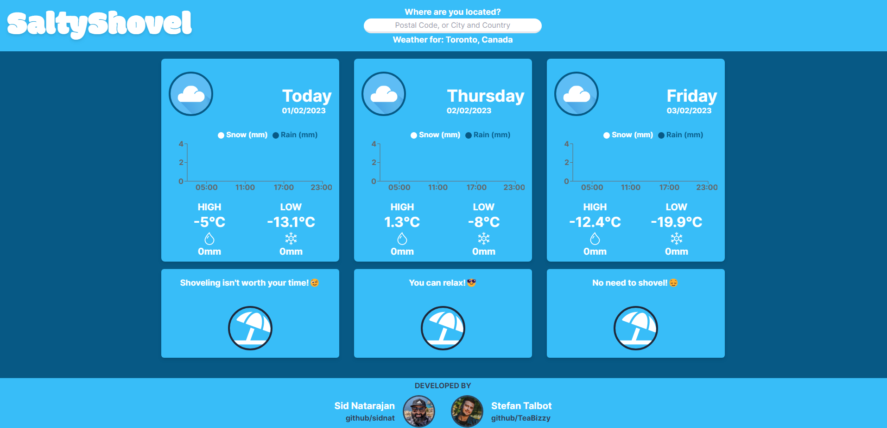
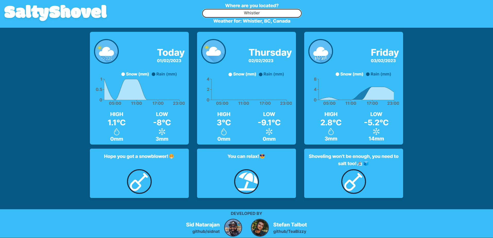
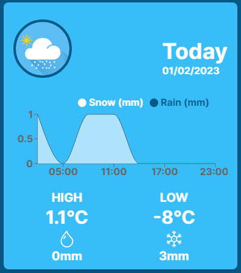
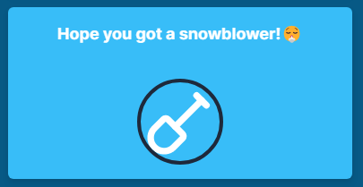
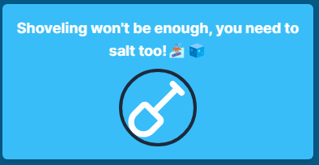
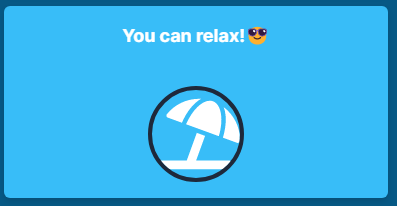

# Salty Shovel

Salty Shovel is a site designed to lets a User know if they need to Shovel and/or Salt. Salty Shovel displays weather data for Toronto, Canada as default.

Salty Shovel also takes in user provided location data in the form of:
- Postal Code
- City (if there are no global duplicates)

If there are duplicate cities, then enter:
- City plus an extra parameter like State, Province, Country etc.

The user inputted location data is sent to the backend, it is first processed by the geocoder API to be formatted into longitude and latitude coordinates, then the coordinates are sent to the weather API to retrieve weather forecast data for Today, Tomorrow, and the Day after tomorrow. Once the data has been digested, Salty Shovel informs the user whether or not they need to Shovel, or Salt, or Shovel AND Salt! and better yet, it tells them if they can kick and and relax with a warm cup of hot chocolate!

---

## Usage

### The Home page
 
The home page displays Toronto, Canada as the default weather data.



### User Location Page

The user can enter a new location to see weather data relevant to them. using the following forms:
- a Postal Code
- City (if there are no global duplicates)

If there are duplicate cities, then enter:
- City plus an extra parameter like State, Province, Country etc.




### Weather Card Components

 The Weather Card for each day displays the following:
 - Weather icon
 - Day and Formatted Date
 - Chart of Snowfall and Rainfall in millimeters during the day
 - Daily High and Daily Low temperatures in Celsius
 - Daily Total Rainfall and Snowfall in milimeters 



 The Determination messages informs the user what they need to do:





---

## Dependencies

Each of the following is necessary in order to run Salty Shovel

- Node 10.x or above
- NPM 5.x or above

### Front-end

- axios": "^1.2.6",
- react": "^18.2.0",
- react-cookie": "^4.1.1",
- react-dom": "^18.2.0",
- react-icons": "^4.7.1",
- react-scripts": "5.0.1",
- recharts": "^2.3.2",

### Back-end

- axios": "^1.2.6",
- cors": "^2.8.5",
- dotenv": "^16.0.3",
- express": "^4.18.2",
- nodemon": "^2.0.20"

### APIs used

- Weather: http://www.weatherunlocked.com/
- Geocoder: https://www.positionstack.com/

---

## Steps for Installation

1. Clone the git repo

```sh
git clone git@github.com:sidnat/to-shovel-or-not.git
```

2. Install the npm packages in both React (Front-end) and Express (Back-end) directories

```sh
npm install
```

---

## Accessing the site

1. Start up the Back-end server from /to-shovel-or-not-express

```sh
npm start
```

2. Start up the Front-end server from /to-shovel-or-not-react

```sh
npm start
```

3. Visit the site from your browser

```sh
http://localhost:3000/
```

---

## Collaborators

The Salty Shovel project was put together by a team of 2 web development graduates from [Lighthouse Labs](https://www.lighthouselabs.ca/)

- [Stefan Talbot](https://github.com/TeaBizzy)
- [Sid Natarajan](https://github.com/sidnat)
